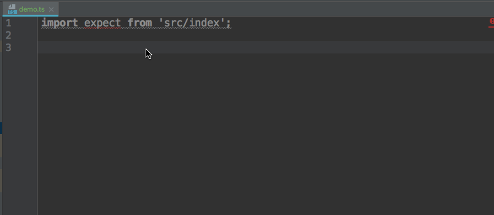

[](https://travis-ci.com/NiGhTTraX/strictly-chai)
[](https://codecov.io/gh/NiGhTTraX/strictly-chai)
[](https://greenkeeper.io/)

> A statically typed subset of [chai](http://www.chaijs.com) assertions written
in TypeScript.


## Usage




This library exports a subset of chai's [BDD API](http://www.chaijs.com/api/bdd/)
so check out their docs on usage. The only difference is that the `.equal`
assertion is by default deep (equivalent to `.deep.equal`).


## Philosophy

```js
expect(new Set([1, 2])).to.contain('a');
```

While the above is perfectly valid JS and chai will throw an AssertionError at
runtime, it was this author's desire to turn that into a compile time error when
using TypeScript.

Using this library instead of `chai.expect` in the assertion above will
fail to compile with the following:

```
TS2345: Argument of type '"a"' is not assignable to parameter of type 'number'.
```


## But wait, what about `@types/chai`?

`@types/chai` declares most arguments as `any` so using chai directly in
TypeScript will not provide meaningful type checking.

Could this library export stricter types to be used in place of `@types/chai`,
instead of also providing a "re-implementation" (the current implementation is
a drop-in replacement) of chai? Perhaps, but the real strength of this library
is the ability to extend it for new types - see below for details.


## Plugins

You can extend this library, similarly to how `chai.use` works, and keep type
safety using `extend`:

```ts
import { extend, Expect, IsType, Plugin } from 'strictly-chai/dist/src/extend';

type MyAwesomeType = {
  myAwesomeProp: 42
};

interface MyAwesomeAssertion {
  to: {
    be: {
      awesome: (expected: number) => void;
    }
  }
}

const isMyAwesomeType: IsType<MyAwesomeType> = (actual: any): actual is MyAwesomeType =>
  ((actual as MyAwesomeType).myAwesomeProp === 42);

const plugin: Plugin<MyAwesomeType, MyAwesomeAssertion> = chai => {
  // You have access to the chai instance so you can do chai.use() here.

  const myAwesomeExpect: Expect<MyAwesomeType, MyAwesomeAssertion> = actual => ({
    to: {
      be: {
        awesome: () => {}
      }
    }
  });

  return {
    isType: isMyAwesomeType,
    expect: myAwesomeExpect
  };
};

const expect = extend(plugin);

// This is our awesome assertion.
expect({ myAwesomeProp: 42 }).to.be.awesome(23);

// TS2345: Argument of type '"foo"' is not assignable to parameter of type 'number'.
expect({ myAwesomeProp: 42 }).to.be.awesome('foo');

// This is from the inherited base assertions.
expect('foobar').to.contain('foo');
```
