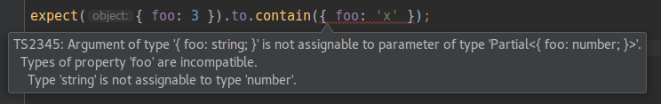

strictly-chai
----

> A statically typed subset of [chai](http://www.chaijs.com) assertions written
in TypeScript.


## Philosophy

```js
expect(new Set([1, 2])).to.contain('a');
```

While the above is perfectly valid JS and chai will throw an AssertionError at
runtime, it is desirable to turn that into a compile time error when using
TypeScript.

Using this library instead of `chai.expect` in the assertion above will
fail to compile with the following:

```
Error:(54, 47) TS2345: Argument of type '"a"' is not assignable
to parameter of type 'number'.
```


## But wait, what about `@types/chai`?

`@types/chai` declares all the arguments as `any` so using chai
directly in TypeScript will not provide any type checking.


## Usage



This library exports a subset of chai's [BDD API](http://www.chaijs.com/api/bdd/)
so check out their docs on usage. The only difference is that the `.equal`
assertion is by default deep (equivalent to `.deep.equal`).
